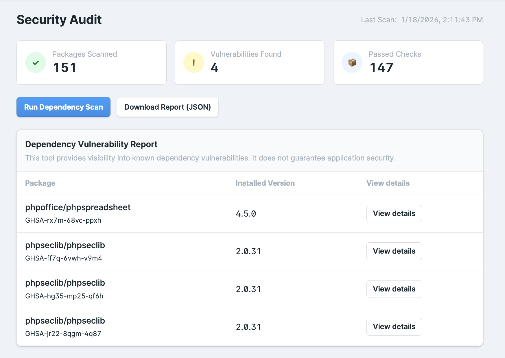
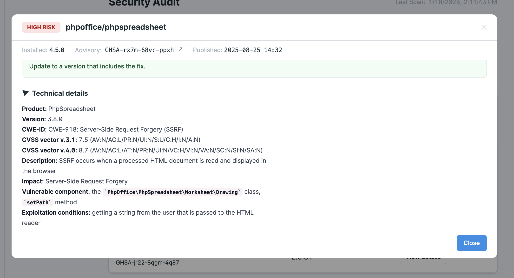
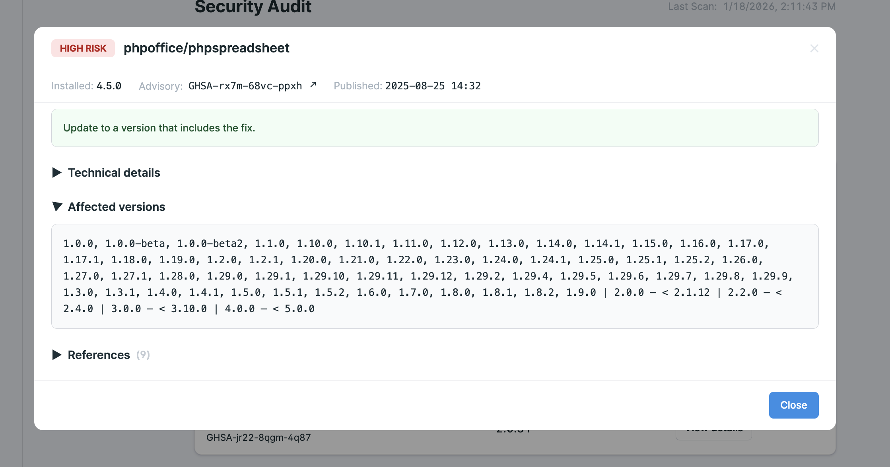
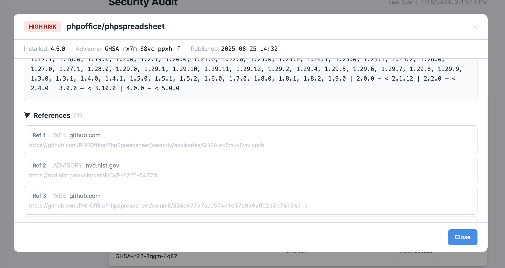
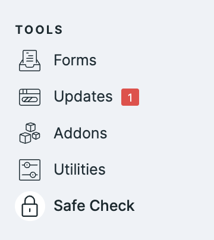

# Safe Check



**Dependency Vulnerability Scanning for Statamic**

Safe Check is a Statamic Control Panel addon that scans your Composer dependencies for **known security vulnerabilities** and presents the results in a **clear, actionable, human-readable format**.

Built for teams who want visibility, not noise.

---

## Why Safe Check?

Modern PHP applications depend on dozens (sometimes hundreds) of third-party packages. Vulnerabilities in those dependencies are one of the most common attack vectors, yet they often go unnoticed.

Safe Check brings **dependency vulnerability awareness directly into the Statamic Control Panel**, without external dashboards, CI complexity, or overwhelming reports.

It’s designed for:

* Statamic developers
* Agencies maintaining multiple sites
* Teams who want *clarity*, not security theater

---

## Key Features

### 🔍 Dependency Vulnerability Scanning

Scan your project’s `composer.lock` file and identify known vulnerabilities using trusted public advisory data.

* Package name
* Installed version
* Vulnerability identifiers (GHSA / OSV IDs)
* Severity (best-effort)
* Affected version ranges

---

### 🧠 Plain-English Explanations

Safe Check doesn’t just list vulnerabilities — it explains them when they are available.

For each issue, you’ll see:

* **What the vulnerability is**
* **Why it matters**
* **What to do next** (update, monitor, or reduce exposure)

This makes the output useful not just for security experts, but for everyday developers.

---

### 📊 Clean Control Panel Interface

All results live inside the Statamic CP, designed to feel native and unobtrusive.

* Scan summary at a glance
* Clear vulnerability table
* Drill-down modal with detailed context
* Technical details and references

**Screenshot: Control Panel overview**


---

### 📄 Exportable Reports

Download a clean JSON report of the latest scan for:

* Audits
* Client handover
* Internal documentation

Exports are intentionally minimal and stable.

#### Sample Export (JSON)

```json
{
  "scanned_at": "2026-01-18T10:42:00Z",
  "packages_scanned": 45,
  "vulnerabilities_found": 1,
  "items": [
    {
      "package": "phpoffice/phpspreadsheet",
      "installed_version": "4.5.0",
      "id": "GHSA-rx7m-68vc-ppxh"
    }
  ]
}
 ```

---

### ⚡ On-Demand & Cached Lookups

Vulnerability detail views are fetched on demand and cached aggressively to keep the Control Panel fast and responsive.

---

## How It Works (High Level)

1. Safe Check reads your `composer.lock` file.
2. Dependencies are checked against public vulnerability advisories.
3. Results are normalized and stored as a scan snapshot.
4. Detailed vulnerability information is fetched only when requested.

No background daemons.
No external dashboards.
No CI setup required.

---

## Permissions & Access Control

Safe Check respects Statamic permissions.

You can control who is allowed to:

* View scan results
* Run new scans
* Export reports

This makes it suitable for multi-user and agency environments.

---

## Screenshots

**Screenshot: Overview**


**Screenshot: Vulnerability Details**


**Screenshot: Technical Details**



**Screenshot: Affected Range**



**Screenshot: References**



**Screenshot: Navigation**



---

## Important Disclaimer ⚠️

Safe Check **does not guarantee the security of your application**.

This addon:

* Reports **known** vulnerabilities in third-party dependencies
* Vulnerability details are displayed on a best-effort basis and may be incomplete when public advisory data is limited or unavailable.
* Does **not** detect zero-day vulnerabilities
* Does **not** analyze your custom application code
* Does **not** replace security reviews, penetration testing, or best practices

Security is a process, not a plugin.

Safe Check is a **visibility and awareness tool**, designed to help you make informed decisions — not a promise of safety.

---

## Requirements

* PHP 8.1+
* Statamic 5.x
* A Composer-managed Statamic project

---

## Support & Updates

Safe Check is a **commercial addon**.

Active license holders receive:

* Bug fixes
* Compatibility updates for new Statamic releases
* Incremental feature improvements

If you need help, encounter a bug, or have questions about usage, please contact us at:

**[Contact Support](mailto:contact@30-bit.com)**

When reaching out, please include:

* Your Statamic version
* Your PHP version
* A brief description of the issue
* Any relevant error messages or screenshots

---

## License

This software is proprietary and licensed for use under the terms provided at purchase.
Redistribution, resale, or modification without permission is not allowed.

---

## Final Notes

Safe Check is intentionally focused.

It does one thing well:

> **Make dependency risk visible and understandable inside Statamic.**

If you value clarity, control, and native tooling — Safe Check belongs in your Control Panel.


